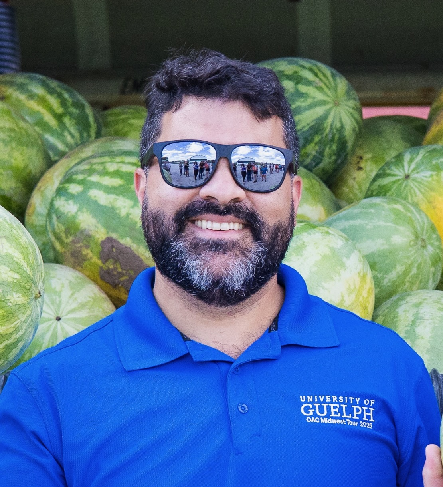
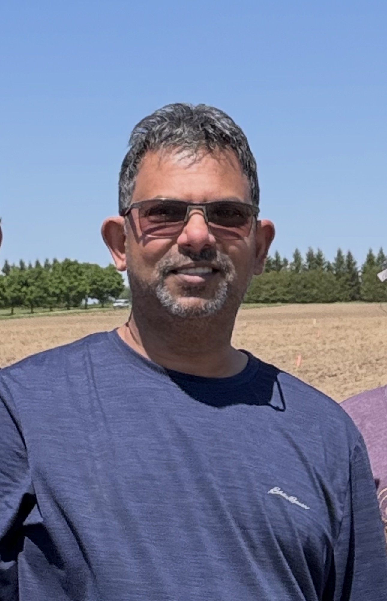

The [Plant Agriculture Field Trip course](https://www.plant.uoguelph.ca/mwtour-course), which is better known around campus as the Midwest Tour, is a field study course designed to increase the student's breadth of knowledge of agricultural production and agri-business in North America. Students in the course tour a selected area of the US Midwest Region prior to the fall semester, visiting cash crop and livestock farms, supporting industries (e.g. processing, manufacturing) and markets (e.g. elevators, stockyards)

If you came across this site by chance, you may be interested in checking out our roots at the [University of Guelph](http://www.uoguelph.ca/), the [Ontario Agriculture College](https://www.uoguelph.ca/oac/) and the [Department of Plant Agriculture](http://www.plant.uoguelph.ca/).

{width="293"}

### 2026 Instructors

{width="288"}

[Dr. Adrian Correndo](https://www.plant.uoguelph.ca/acorrend)   
Assistant Professor   
Pick Family Research Chair | Sustainable Cropping Systems  
Department of Plant Agriculture   University of Guelph  

{width="288"}

MSc Laxhman Ramsahoi   Field Research Technician, Sustainable Cropping Systems   Department of Plant Agriculture   University of Guelph  
